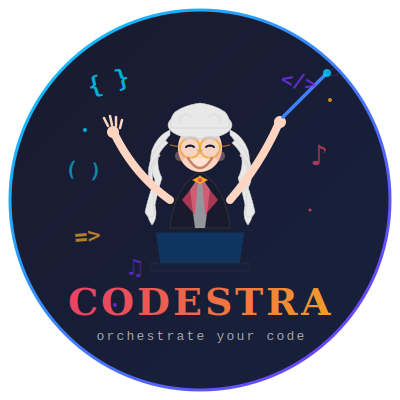
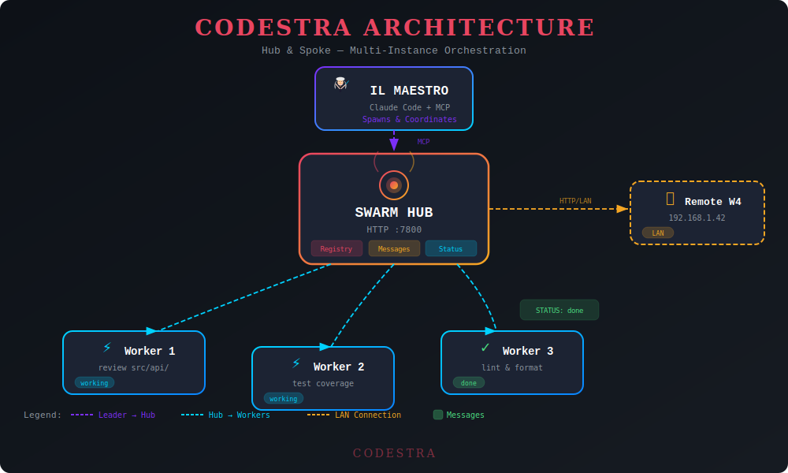

<p align="center">
  
</p>

<p align="center">
  
</p>

<h3 align="center">🎼 Orchestrate your Claude Code instances</h3>

<p align="center">
  <strong>Codestra</strong> is a plugin for Claude Code that lets you coordinate multiple instances<br/>
  through a Hub &amp; Spoke architecture — like a conductor leading an orchestra of AI agents.
</p>

<p align="center">
  <a href="#-quick-start"></a>
  <a href="#-architecture"></a>
  <a href="#-mcp-tools"></a>
</p>

<p align="center">
  
  
  
  
</p>

---

## The Problem

You have one Claude Code instance. It's powerful, but some tasks are too big — reviewing an entire codebase, running parallel analyses, coordinating work across multiple directories or machines.

**Codestra** solves this by letting one instance (the **Leader**, a.k.a. *Il Maestro*) spawn and coordinate multiple **Worker** instances through a central **Hub**, just like a conductor directing an orchestra.

## ✨ Features

🎭 **Hub & Spoke Architecture** — One leader, N workers, one central hub that coordinates everything

📡 **MCP Native** — Built on the Model Context Protocol standard. Each instance communicates through MCP tools, no custom APIs

🌐 **LAN Ready** — Run workers across multiple machines on your network. Set `SWARM_HUB_URL` and you're connected

💬 **Real-time Messaging** — Workers and leader communicate through the hub with direct messages or broadcasts

🔐 **Simple Auth** — Optional `SWARM_SECRET` token for secured environments

⚡ **Auto-Registration** — Workers register themselves with the hub automatically on session start via hooks

## 🚀 Quick Start

### 1. Install the Plugin

```bash
claude plugin marketplace add ThinkGab/codestra && claude plugin install codestra@claude-swarm
```

### 2. Install Server Dependencies

```bash
cd ~/.claude/plugins/codestra/servers
npm install
```

### 3. Start the Hub

```bash
# On your machine (localhost)
node ~/.claude/plugins/codestra/servers/hub.mjs

# On LAN with auth
SWARM_HOST=0.0.0.0 SWARM_SECRET=mysecret node ~/.claude/plugins/codestra/servers/hub.mjs
```

### 4. Launch Claude Code as Leader

```bash
SWARM_ROLE=leader claude
```

Then just ask Claude to orchestrate:

> *"Review all TypeScript files in src/ for security issues — use 3 parallel workers"*

Il Maestro will take it from there. 🎼

## 🏗 Architecture

<p align="center">
  
</p>

### How It Works

```
                    ┌──────────────────┐
                    │    IL MAESTRO    │
                    │   (Leader)       │
                    │  Claude Code     │
                    └────────┬─────────┘
                             │ MCP
                    ┌────────▼─────────┐
                    │    SWARM HUB     │
                    │   HTTP :7800     │
                    │ ┌──────┬───────┐ │
                    │ │ Reg. │ Msgs  │ │
                    │ └──────┴───────┘ │
                    └──┬─────┬─────┬───┘
                       │     │     │
               ┌───────▼┐ ┌─▼────┐ ┌▼───────┐
               │Worker 1│ │Wrk 2 │ │Wrk 3   │
               │ review │ │ test │ │ lint   │
               └────────┘ └──────┘ └────────┘
```

The **Hub** is a lightweight HTTP server that tracks workers and routes messages. Each Claude Code instance runs an **MCP server** (stdio) that bridges to the hub. The Leader spawns workers, assigns tasks, and collects results.

## 🔧 MCP Tools

Once the plugin is installed, these tools are available to Claude Code:

| Tool | Description |
|:-----|:------------|
| `swarm_hub_start` | Get the command to start the hub server |
| `swarm_hub_status` | Check if the hub is running (health, worker count, uptime) |
| `swarm_register` | Register this instance with the hub |
| `swarm_spawn_worker` | Spawn a new Claude Code worker with a specific task |
| `swarm_list_workers` | List all registered workers with role, status, and task |
| `swarm_send_message` | Send a message to a worker or broadcast to all |
| `swarm_read_messages` | Read messages addressed to this instance |
| `swarm_update_status` | Update this worker's status or current task |
| `swarm_kill_worker` | Unregister a worker from the hub |

## 🎯 Orchestration Patterns

### Fan-Out / Fan-In

Split a task into N independent parts, process in parallel, merge results.

```
Leader: "Review the entire codebase"
  ├── Worker 1: review src/api/
  ├── Worker 2: review src/models/
  └── Worker 3: review src/utils/
Leader: collects all reports → unified summary
```

### Sequential Pipeline

Chain workers where each stage depends on the previous.

```
Worker A: parse raw data
  └── Worker B: transform & validate
       └── Worker C: generate report
```

### Supervised Retry

Automatically retry failed workers with adjusted prompts (max 3 attempts).

## 🌐 Multi-Machine Setup (LAN)

Run Codestra across your local network:

**Hub machine** (e.g., `192.168.1.100`):
```bash
SWARM_HOST=0.0.0.0 \
SWARM_SECRET=orchestra \
SWARM_PORT=7800 \
node servers/hub.mjs
```

**Other machines:**
```bash
export SWARM_HUB_URL=http://192.168.1.100:7800
export SWARM_SECRET=orchestra
claude  # auto-registers via SessionStart hook
```

## ⚙️ Configuration

| Environment Variable | Default | Description |
|:---------------------|:--------|:------------|
| `SWARM_HUB_URL` | `http://localhost:7800` | Hub server URL |
| `SWARM_PORT` | `7800` | Hub listen port |
| `SWARM_HOST` | `0.0.0.0` | Hub bind address |
| `SWARM_SECRET` | *(empty)* | Shared auth token |
| `SWARM_ROLE` | `worker` | Instance role: `leader` or `worker` |
| `SWARM_ID` | *(auto-generated)* | Fixed ID for this instance |

## 📦 Plugin Contents

```
codestra/
├── .claude-plugin/
│   └── plugin.json          # Plugin manifest
├── skills/
│   ├── orchestrate/         # Spawn & manage workers
│   │   ├── SKILL.md
│   │   └── references/
│   │       └── patterns.md  # Advanced orchestration patterns
│   └── messaging/           # Inter-instance communication
│       └── SKILL.md
├── hooks/
│   └── hooks.json           # Auto-register on SessionStart
├── servers/
│   ├── hub.mjs              # HTTP hub server
│   ├── mcp-server.mjs       # MCP stdio bridge
│   └── package.json
├── .mcp.json                # MCP server config
└── README.md
```

## 🔒 Security Notes

- **Always set `SWARM_SECRET`** when running on a LAN — without it, anyone on the network can interact with the hub
- The hub binds to `0.0.0.0` by default for LAN access; use `SWARM_HOST=127.0.0.1` for localhost-only
- No TLS built-in — for internet use, put the hub behind a reverse proxy with HTTPS
- Messages are stored in-memory and cleared when the hub restarts

## 🤝 Contributing

Contributions are welcome! Feel free to open issues or pull requests.

## 📄 License

MIT License — see [LICENSE](LICENSE) for details.

---

<p align="center">
  
  <br/>
  <sub>Built with ❤️ by <strong>Ivan Di Lelio</strong></sub>
  <br/>
  <sub><em>"Every great codebase deserves a great conductor."</em></sub>
</p>
